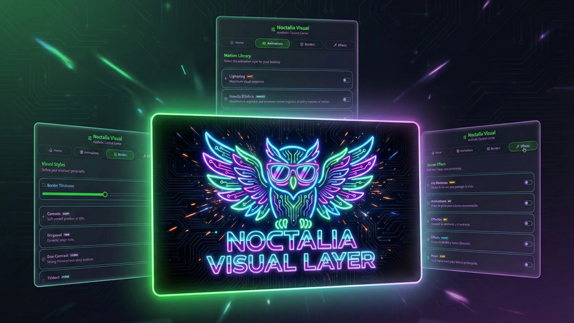
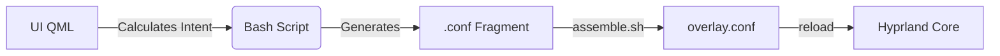

<p align="center">
  
</p>

# 🦉 Noctalia Visual Layer
### Dynamic Visual Layer for Hyprland Customization


**Noctalia Visual Layer (NVL)** is a dynamic and non-destructive customization ecosystem for **Hyprland** and **Noctalia Shell**, developed with **Quickshell (QML)** and **Bash**. It allows you to instantly change animations, borders, shaders, and geometry, without any risk of corrupting the user's main configuration.

---

## ✨ Key Features

| Feature | Description |
| :--- | :--- |
| **🛡️ Non-Destructive Architecture** | NVL never touches your personal config. It works entirely on a safe, encapsulated top layer. |
| **⚡ Instant Application** | The reactive logic applies any change in milliseconds, without the need to reload the session. |
| **🎬 Motion Library** | From the smoothness of *Silk* to the aggressiveness of *Cyber Glitch*. |
| **🎨 Smart Borders** | Dynamic gradients and reactive effects tied to window focus. |
| **🕶️ Real-Time Shaders** | Post-processing filters (Night, CRT, Monochrome, OLED) applied on the fly. |
| **🌍 Internationalization** | Native multilingual support. The system automatically adapts to your system's language. |

---

## 📂 Project Structure

```text
noctalia-visual-layer/
├── manifest.json           # Plugin metadata and definitions
├── BarWidget.qml           # Entry Point: Taskbar trigger icon
├── Panel.qml               # Main UI Container (Module host)
├── overlay.conf            # MASTER CONFIG: Sourced directly by Hyprland
│
├── modules/                # UI Components (QML)
│   ├── WelcomeModule.qml   # Persistence & Welcome screen
│   ├── BorderModule.qml    # Style & Geometry selector
│   └── ...                 # Animation and Shader modules
│
├── assets/                 # The "Engine" & Resources
│   ├── nvl-colors.conf     # DYNAMIC: Processed colors with Alpha support
│   ├── borders/            # Border styles library (.conf)
│   ├── animations/         # Movement & Bezier curves library (.conf)
│   ├── shaders/            # GLSL Post-processing filters (.frag)
│   ├── fragments/          # Symlinks of current active styles
│   └── scripts/            # Bash Engine (Assembly and logic)
│
└── i18n/                   # Multilingual support (Translations)

```

---

## 🚀 Installation and Activation

**Noctalia Shell** and **Hyprland** are required to use this plugin. Here are the exact steps for a proper installation:

1. Download this repository into the path `~/.config/noctalia/plugins/`.
2. Once the plugin is in the correct directory, go to Noctalia Shell's **Settings** and navigate to the **Plugins** section. It should appear in the installed list, where you can enable it. Once active, the plugin icon will appear in your Noctalia bar.
3. Open the plugin panel and toggle the **"Enable Visual Layer"** switch to allow the modifications to take effect.

> [!NOTE]
> When activated, the system will automatically inject a secure source line (`source = .../overlay.conf`) into your `hyprland.conf`. When deactivated, it will clean up your configuration, leaving it in its original state.

---

## 🧠 Technical Architecture (The Fragment System)

Unlike other managers that edit static files directly, NVL uses a **dynamic construction** flow:

1. **Dynamic Scanning:** The `scan.sh` script extracts metadata directly from the comments within the `assets/` files.
2. **Fragment Generation:** When a style is selected via QML, it is cloned into `assets/fragments/`.
3. **Assembly:** The `assemble.sh` script unifies all active fragments.
4. **Injection:** The `overlay.conf` is generated and Hyprland reloads it instantly.



---

## 🛠️ Modding Guide (Metadata Protocol)

To add your own custom files and have them automatically appear in the panel, use the following header format:

### For Animations and Borders (`.conf`)

```ini
# @Title: My Epic Style
# @Icon: rocket
# @Color: #ff0000
# @Tag: CUSTOM
# @Desc: A brief description of your creation.

general {
    col.active_border = rgb(ff0000) rgb(00ff00) 45deg
}

```

### For Shaders (`.frag`)

```glsl
// @Title: Vision Filter
// @Icon: eye
// @Color: #4ade80
// @Tag: NIGHT
// @Desc: Post-processing description.

void main() { ... }

```

### 🎨 Iconography

The system utilizes **Tabler Icons**. To add new icons, browse the catalog at [tabler-icons.io](https://tabler-icons.io/) and use the exact icon name (e.g., `brand-github`, `bolt`).

---

## ⚠️ Troubleshooting

**The panel displays exclamation marks `!!text!!` in a style name/description.**

* The system cannot find the official translation key. If the issue persists, the system will safely fallback to the raw text provided in your file.

**I created a custom style and Hyprland throws an error.**

* NVL isolates all errors within `overlay.conf`. If a custom style fails to load, double-check the Hyprland syntax in your personal `.conf` file.

**Border animations stop looping and freeze.**

* This is a known limitation of the Hyprland engine when hot-reloading the configuration on currently drawn windows. The immediate solution is to simply reopen the affected window. Regardless, this issue will naturally fade away as you open new windows during your regular workflow, and the looping effect will apply flawlessly across the board upon your next session restart.

---

## ❤️ Credits and Authorship

* **Architecture & Core:** Ximo
* **Technical Assistance:** Co-programmed with AI (Gemini - Google)
* **Inspiration:** HyDE Project & JaKooLit.
* **Community:** Thanks to all Noctalia users.
